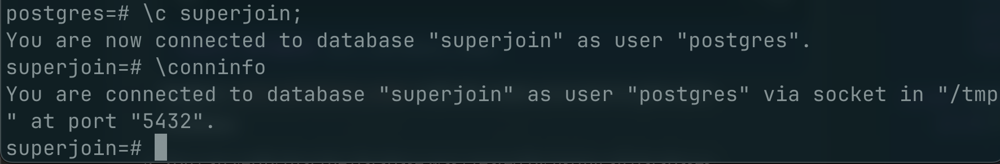
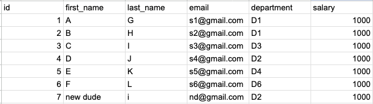
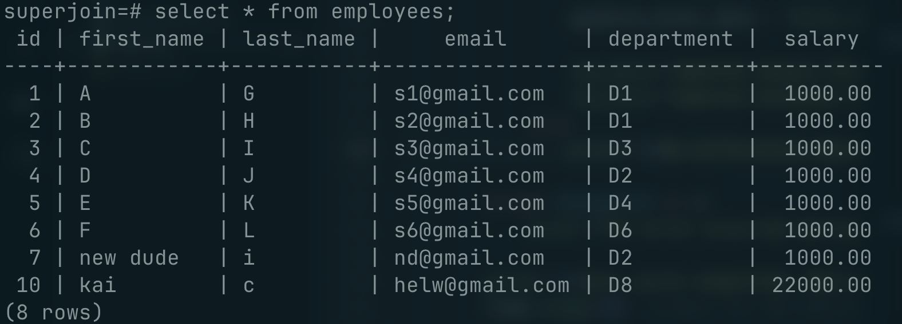
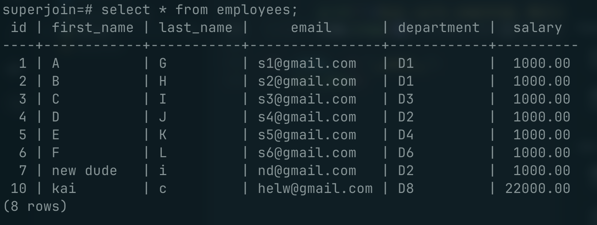
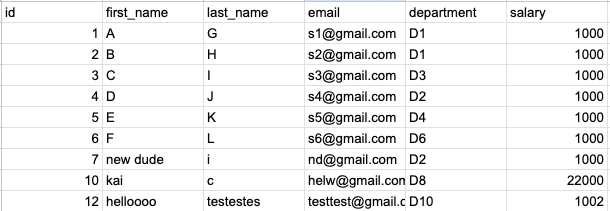
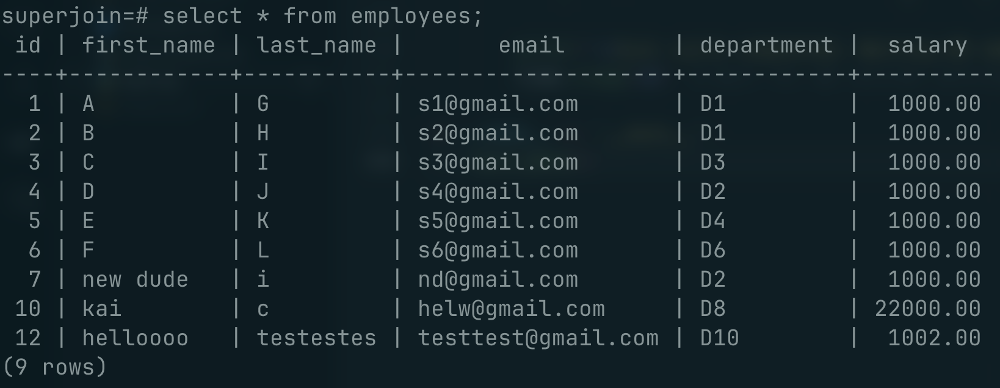
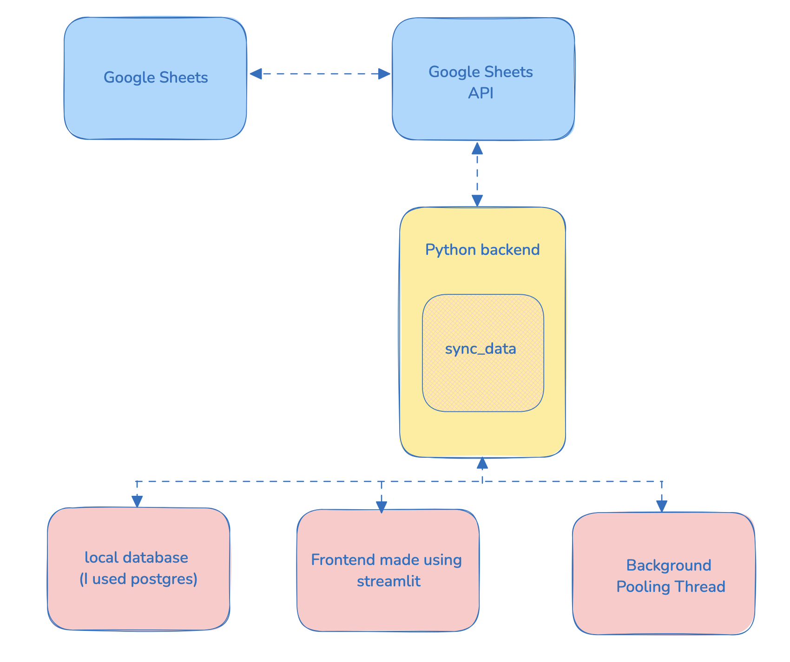
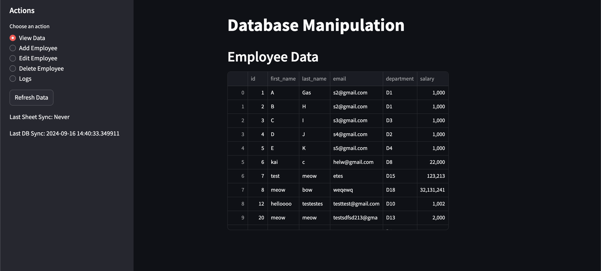
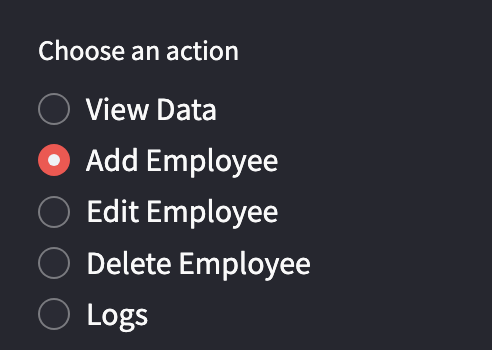

# Google Sheets-Database Sync

This project implements a real-time synchronization system between Google Sheets and a PostgreSQL database. It ensures that changes made in either the Google Sheet or the database are reflected in the other, maintaining data consistency across both platforms.

## Features

- Real-time bidirectional synchronization between Google Sheets and PostgreSQL database
- Support for Create, Read, Update, and Delete (CRUD) operations
- Automatic conflict resolution.
- User-friendly Streamlit interface for data manipulation without any conflicts
- Efficient polling mechanism for detecting changes

## Technologies Used 🖥️

As a developer, I tried finding a solution for this problem in the simplest way possible. This was the tech stack I found the most minimal but effective.

- Python
- Google Sheets API
- PostgreSQL
- Streamlit
- Pandas

## Setup and Installation

1. Clone the repository:

   ```
   git clone git@github.com:StackItHQ/pes-siddarthpai.git
   cd pes-siddarthpai
   ```

2. Install the required dependencies:

   ```
   pip install -r requirements.txt
   ```

3. Set up Google Sheets API credentials:

   - Follow the [Google Sheets API Python Quickstart](https://developers.google.com/sheets/api/quickstart/python) to obtain the necessary credentials.
   - Save the credentials as `credentials.json` in the project root directory.

4. Configure the PostgreSQL database:

   - Update the database connection details in `backend.py`:
     ```python
     DB_NAME = "your_db_name"
     DB_USER = "your_db_user"
     DB_PASSWORD = "your_db_password"
     DB_HOST = "your_db_host"
     DB_PORT = "your_db_port"
     ```
     - I logged into postgres locally using
       `psql -U postgres`
     - Once inside postgres, databases can be viewed using
       `\l`
     - Create a new database and then run `\conninfo` to get the details of the connection
       

5. Update the Google Sheet ID:

   - Replace `SAMPLE_SPREADSHEET_ID` in `backend.py` with your Google Sheet ID.
     - to get the SAMPLE_SPREADSHEET_ID, copy the unique id between the `/d` and `/edit` in the URL
       

6. Run the Streamlit app:
   ```
   streamlit run app.py
   ```

## Implementation Details

1. **Real-time Synchronization**:

   - Implemented a polling mechanism that checks for changes every 1-2 seconds.
   - Uses a `data_changed` event to signal when updates are needed.

2. **CRUD Operations**:

   - **Create:** New records can be added through the Streamlit interface or directly in the Google Sheet/local database.
   - **Read:** Data is displayed in the Streamlit interface and can be viewed in the Google Sheet/local database.
   - **Update:** Records can be edited through the Streamlit interface or in the Google Sheet/local database.
   - **Delete:** Records can be deleted through the Streamlit interface or by removing rows in the Google Sheet/local database.

   These CRUD operations can be performed on one datasource and will be reflected on the other. To ensure highest consistency, the user can feel free to use the streamlit UI which allows for CRUD operations.

3. **Conflict Resolution**:

   - In case of conflicting changes between sync cycles, data from the Google Sheet takes precedence.
   - Changes made in the database are then merged with the sheet data, preserving the most recent state from both sources.

   Note: I did try to implement `last write wins` but my implementation technique for that included adding a column to both the google sheet and the database to hold the `last modified time` but realised it wouldn't be effective to add columns to the customer data and hence proceeded with a `user defined rule` approach.

4. **Data Consistency**:

   - Ensures that both the Google Sheet and the database contain the same data after each sync cycle.

5. **Error Handling**:

   - Implements try-except blocks to catch and log errors during synchronization and data operations. Checks properly for types and ensures that invalid data is rolled back/ignored.

6. **Scalability:**
   To ensure scalability, I've implemented several optimizations.

   1. First, I'm using **batch operations** for database updates, which significantly reduces the number of queries for large datasets.
   2. Implemented an efficient **upsert** operation to handle both inserts and updates in a single query.
   3. Higher polling interval to reduce synchronization frequency, and data fetching has been optimized to only retrieve necessary columns.
   4. Finally, conflict resolution is performed in-memory using pandas, which is highly efficient for data manipulation tasks.

   These optimizations allow the system to handle larger datasets and higher update frequencies without significant performance degradation.

## Plan of Action 📝

First started off by understanding the basics of the stack that I'd be using : **[all of these files can be found in the testing folder]**

1. Configured the Google Sheets API and tested if it was connecting successfully or not. Then created a basic flask app to check. After this stage, I created my first PR and initialized the repo (Created a .gitignore file as well!)
2. After this I ran my first sync cycle to check the data its retrieving from the sheet and matching it to the Database. I logged this entirely to see before and after and here were the results :

#### before:


[the google sheet had no entry of id 10]

_[I added in 10 to the local database]_

#### after the sync


##### please find the logs attached at the end[log 1]

### I also tried the other way

#### before:



_here I inserted in the google sheet_

#### after:



##### please find the logs attached at the end[log 2]

this is gave me an idea on how I could sync between the 2 sources .

After this I came up with a unified script which had both the frontend and backend code. I finally split the code into the front end and backend to reach the final outcome.

## Outcome



1. **Backend Design**:

   - Created a `backend.py` file to handle all database and Google Sheets operations.
   - Implemented functions for fetching, updating, and syncing data between the two platforms.

2. **Frontend Design**:
   

   - Used Streamlit to create a user-friendly interface for data manipulation.
   - Implemented different views for adding, editing, and deleting records.
     
   - Added in a couple of graphs for visualization so that the user/developer knows whats happening

3. **Synchronization Logic**:

   - Developed a `sync_data` function that compares data between the Google Sheet and the database.
   - Implemented logic to detect and apply changes in both directions.

4. **Continuous Polling**:
   - Created a background thread that continuously calls the `sync_data` function to keep data up-to-date.

## Challenges and Solutions

1. **Data Type Consistency**: When I first started out, I realised that google sheets doesn't have type checking and that I had to ensure type checking. I then Ensured consistent data types between Google Sheets and PostgreSQL by implementing strict type checking and conversion.

2. **Scopes**: I had to understand how scopes works in google sheets as I need to give read and write permission to read and edit the sheet respectively.

3. **SSL**: I faced issues with SSL certificates when trying to update the sheet and I had to reinstall and reconfigure it.

4. **Real-time Updates**: I Implemented a polling mechanism and used Streamlit's caching to provide near real-time updates without overloading the system.

5. **Error Handling**: I developed robust error handling to manage potential issues with API calls, database connections, and data inconsistencies using try and catch blocks.

## Video Link

https://drive.google.com/file/d/1TldAS8F7RFkkPbNBOV4kXKTSoEN4_07y/view?usp=sharing

## Future Improvements 🚀

- Implement websockets for real-time updates instead of polling
  **(I was also looking at GCP's pub/sub model, but to keep the solution as simple as possible without complicating the tech stack, I found a way without it. The plan was to use pub/sub so that when any change is detected on the sheet, the sheet is directly updated.)**
- Add user authentication and multi-user support (right now the best way I found to implement this was to enforce token generation everytime[requires a google login] but wasn't time effective).
- Improve conflict resolution strategies with user-defined rules for custom tables
- Optimize for larger datasets with pagination and lazy loading

## Checklist ✅

- [x] My code's working just fine! 🥳
- [x] I have recorded a video showing it working and embedded it in the README.
- [x] I have tested all the normal working cases 😎
- [x] I have even solved some edge cases 💪
- [x] I added my very planned-out approach to the problem to this README 📜

### Logs 📑

#### Log 1

```
Current Google Sheet Data:
--------------------------------------------------
[['id', 'first_name', 'last_name', 'email', 'department', 'salary'],
 ['1', 'A', 'G', 's1@gmail.com', 'D1', '1000'],
 ['2', 'B', 'H', 's2@gmail.com', 'D1', '1000'],
 ['3', 'C', 'I', 's3@gmail.com', 'D3', '1000'],
 ['4', 'D', 'J', 's4@gmail.com', 'D2', '1000'],
 ['5', 'E', 'K', 's5@gmail.com', 'D4', '1000'],
 ['6', 'F', 'L', 's6@gmail.com', 'D6', '1000'],
 ['7', 'new dude', 'i', 'nd@gmail.com', 'D2', '1000']]
--------------------------------------------------

Current Database Data:
--------------------------------------------------
[{'department': 'D1',
  'email': 's1@gmail.com',
  'first_name': 'A',
  'id': 1,
  'last_name': 'G',
  'salary': Decimal('1000.00')},
 {'department': 'D1',
  'email': 's2@gmail.com',
  'first_name': 'B',
  'id': 2,
  'last_name': 'H',
  'salary': Decimal('1000.00')},
 {'department': 'D3',
  'email': 's3@gmail.com',
  'first_name': 'C',
  'id': 3,
  'last_name': 'I',
  'salary': Decimal('1000.00')},
 {'department': 'D2',
  'email': 's4@gmail.com',
  'first_name': 'D',
  'id': 4,
  'last_name': 'J',
  'salary': Decimal('1000.00')},
 {'department': 'D4',
  'email': 's5@gmail.com',
  'first_name': 'E',
  'id': 5,
  'last_name': 'K',
  'salary': Decimal('1000.00')},
 {'department': 'D6',
  'email': 's6@gmail.com',
  'first_name': 'F',
  'id': 6,
  'last_name': 'L',
  'salary': Decimal('1000.00')},
 {'department': 'D2',
  'email': 'nd@gmail.com',
  'first_name': 'new dude',
  'id': 7,
  'last_name': 'i',
  'salary': Decimal('1000.00')},
 {'department': 'D8',
  'email': 'helw@gmail.com',
  'first_name': 'kai',
  'id': 10,
  'last_name': 'c',
  'salary': Decimal('22000.00')}]
--------------------------------------------------

Differences detected. Updating...
Updated database from Google Sheets
Successfully updated Google Sheets

Updated Google Sheet Data:
--------------------------------------------------
[['id', 'first_name', 'last_name', 'email', 'department', 'salary'],
 ['1', 'A', 'G', 's1@gmail.com', 'D1', '1000'],
 ['2', 'B', 'H', 's2@gmail.com', 'D1', '1000'],
 ['3', 'C', 'I', 's3@gmail.com', 'D3', '1000'],
 ['4', 'D', 'J', 's4@gmail.com', 'D2', '1000'],
 ['5', 'E', 'K', 's5@gmail.com', 'D4', '1000'],
 ['6', 'F', 'L', 's6@gmail.com', 'D6', '1000'],
 ['7', 'new dude', 'i', 'nd@gmail.com', 'D2', '1000'],
 ['10', 'kai', 'c', 'helw@gmail.com', 'D8', '22000']]
--------------------------------------------------

Updated Database Data:
--------------------------------------------------
[{'department': 'D1',
  'email': 's1@gmail.com',
  'first_name': 'A',
  'id': 1,
  'last_name': 'G',
  'salary': Decimal('1000.00')},
 {'department': 'D1',
  'email': 's2@gmail.com',
  'first_name': 'B',
  'id': 2,
  'last_name': 'H',
  'salary': Decimal('1000.00')},
 {'department': 'D3',
  'email': 's3@gmail.com',
  'first_name': 'C',
  'id': 3,
  'last_name': 'I',
  'salary': Decimal('1000.00')},
 {'department': 'D2',
  'email': 's4@gmail.com',
  'first_name': 'D',
  'id': 4,
  'last_name': 'J',
  'salary': Decimal('1000.00')},
 {'department': 'D4',
  'email': 's5@gmail.com',
  'first_name': 'E',
  'id': 5,
  'last_name': 'K',
  'salary': Decimal('1000.00')},
 {'department': 'D6',
  'email': 's6@gmail.com',
  'first_name': 'F',
  'id': 6,
  'last_name': 'L',
  'salary': Decimal('1000.00')},
 {'department': 'D2',
  'email': 'nd@gmail.com',
  'first_name': 'new dude',
  'id': 7,
  'last_name': 'i',
  'salary': Decimal('1000.00')},
 {'department': 'D8',
  'email': 'helw@gmail.com',
  'first_name': 'kai',
  'id': 10,
  'last_name': 'c',
  'salary': Decimal('22000.00')}]
--------------------------------------------------
```

### Log 2:

```Current Google Sheet Data:
--------------------------------------------------
[['id', 'first_name', 'last_name', 'email', 'department', 'salary'],
 ['1', 'A', 'G', 's1@gmail.com', 'D1', '1000'],
 ['2', 'B', 'H', 's2@gmail.com', 'D1', '1000'],
 ['3', 'C', 'I', 's3@gmail.com', 'D3', '1000'],
 ['4', 'D', 'J', 's4@gmail.com', 'D2', '1000'],
 ['5', 'E', 'K', 's5@gmail.com', 'D4', '1000'],
 ['6', 'F', 'L', 's6@gmail.com', 'D6', '1000'],
 ['7', 'new dude', 'i', 'nd@gmail.com', 'D2', '1000'],
 ['10', 'kai', 'c', 'helw@gmail.com', 'D8', '22000'],
 ['12', 'helloooo', 'testestes', 'testtest@gmail.com', 'D10', '1002']]
--------------------------------------------------

Current Database Data:
--------------------------------------------------
[{'department': 'D1',
  'email': 's1@gmail.com',
  'first_name': 'A',
  'id': 1,
  'last_name': 'G',
  'salary': Decimal('1000.00')},
 {'department': 'D1',
  'email': 's2@gmail.com',
  'first_name': 'B',
  'id': 2,
  'last_name': 'H',
  'salary': Decimal('1000.00')},
 {'department': 'D3',
  'email': 's3@gmail.com',
  'first_name': 'C',
  'id': 3,
  'last_name': 'I',
  'salary': Decimal('1000.00')},
 {'department': 'D2',
  'email': 's4@gmail.com',
  'first_name': 'D',
  'id': 4,
  'last_name': 'J',
  'salary': Decimal('1000.00')},
 {'department': 'D4',
  'email': 's5@gmail.com',
  'first_name': 'E',
  'id': 5,
  'last_name': 'K',
  'salary': Decimal('1000.00')},
 {'department': 'D6',
  'email': 's6@gmail.com',
  'first_name': 'F',
  'id': 6,
  'last_name': 'L',
  'salary': Decimal('1000.00')},
 {'department': 'D2',
  'email': 'nd@gmail.com',
  'first_name': 'new dude',
  'id': 7,
  'last_name': 'i',
  'salary': Decimal('1000.00')},
 {'department': 'D8',
  'email': 'helw@gmail.com',
  'first_name': 'kai',
  'id': 10,
  'last_name': 'c',
  'salary': Decimal('22000.00')}]
--------------------------------------------------

Differences detected. Updating...
Updated database from Google Sheets
Successfully updated Google Sheets

Updated Google Sheet Data:
--------------------------------------------------
[['id', 'first_name', 'last_name', 'email', 'department', 'salary'],
 ['1', 'A', 'G', 's1@gmail.com', 'D1', '1000'],
 ['2', 'B', 'H', 's2@gmail.com', 'D1', '1000'],
 ['3', 'C', 'I', 's3@gmail.com', 'D3', '1000'],
 ['4', 'D', 'J', 's4@gmail.com', 'D2', '1000'],
 ['5', 'E', 'K', 's5@gmail.com', 'D4', '1000'],
 ['6', 'F', 'L', 's6@gmail.com', 'D6', '1000'],
 ['7', 'new dude', 'i', 'nd@gmail.com', 'D2', '1000'],
 ['10', 'kai', 'c', 'helw@gmail.com', 'D8', '22000'],
 ['12', 'helloooo', 'testestes', 'testtest@gmail.com', 'D10', '1002']]
--------------------------------------------------

Updated Database Data:
--------------------------------------------------
[{'department': 'D1',
  'email': 's1@gmail.com',
  'first_name': 'A',
  'id': 1,
  'last_name': 'G',
  'salary': Decimal('1000.00')},
 {'department': 'D1',
  'email': 's2@gmail.com',
  'first_name': 'B',
  'id': 2,
  'last_name': 'H',
  'salary': Decimal('1000.00')},
 {'department': 'D3',
  'email': 's3@gmail.com',
  'first_name': 'C',
  'id': 3,
  'last_name': 'I',
  'salary': Decimal('1000.00')},
 {'department': 'D2',
  'email': 's4@gmail.com',
  'first_name': 'D',
  'id': 4,
  'last_name': 'J',
  'salary': Decimal('1000.00')},
 {'department': 'D4',
  'email': 's5@gmail.com',
  'first_name': 'E',
  'id': 5,
  'last_name': 'K',
  'salary': Decimal('1000.00')},
 {'department': 'D6',
  'email': 's6@gmail.com',
  'first_name': 'F',
  'id': 6,
  'last_name': 'L',
  'salary': Decimal('1000.00')},
 {'department': 'D2',
  'email': 'nd@gmail.com',
  'first_name': 'new dude',
  'id': 7,
  'last_name': 'i',
  'salary': Decimal('1000.00')},
 {'department': 'D8',
  'email': 'helw@gmail.com',
  'first_name': 'kai',
  'id': 10,
  'last_name': 'c',
  'salary': Decimal('22000.00')},
 {'department': 'D10',
  'email': 'testtest@gmail.com',
  'first_name': 'helloooo',
  'id': 12,
  'last_name': 'testestes',
  'salary': Decimal('1002.00')}]
--------------------------------------------------
```
